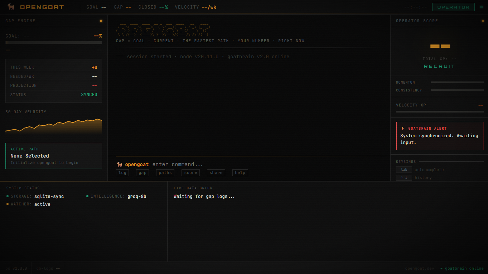

# OpenGOAT — A Terminal Brain That Tells You If You're Actually Going to Hit Your Goal

<div align="center">

<p align="center">
  
</p>

[](https://github.com/vaibhavos/OpenGOAT/stargazers)
[](LICENSE)
[](https://www.typescriptlang.org/)
[](#)
[](#)
[](https://github.com/vaibhavos/OpenGOAT/commits)

**Stop organising your goals. Start executing them.**

[Quick Start](#quickstart) · [How It Works](#goatbrain-architecture) · [Commands](#full-usage-guide) · [Roadmap](#roadmap) · [Newsletter](#connect)

</div>

---

## 🛑 Notion is a blank canvas. This is an engine.

Task managers don't work because they are infinite checklists. Notion is completely frictionless, which means you spend hours building tracking systems instead of executing.

Every goal tool has the same fatal flaw: **they record what you did without telling you what it means.** They give you a beautiful graveyard of logged effort with zero signal on whether you're winning.

**OpenGOAT fixes this with one number: your Projected Completion Date.**

It maps your 5D resources (Time, Capital, Skills, Network, Assets), calculates exactly how far you are from your goal — **The Gap** — and uses **GoatBrain** (Claude, GPT-4o, Groq Llama3, or local Ollama) to generate the **5 mathematically fastest paths** to close it.

One action at a time. Pure velocity. No bullshit.

---

## ⚡ Quickstart (Under 4 Minutes)

```bash
# 1. Install globally
npm install -g opengoat

# 2. Initialise GoatBrain
opengoat init
# You'll be asked your goal, your starting number, and 5 rapid-fire resource questions.

# 3. Choose your strategy
opengoat paths
# GoatBrain ranks the Top 5 fastest paths based solely on your advantages. Pick one.

# 4. Execute daily
opengoat log 1050
# 3 seconds. Updates your gap, recalculates 7-day velocity, renders your Operator Rank.
```

```
$ opengoat log 2340

  ┌─────────────────────────────────┐
  │  GAP           : 7,660          │
  │  7-DAY VELOCITY: +312/day       │
  │  PROJECTED DONE: April 14, 2025 │
  │  OPERATOR RANK : GHOST II       │
  └─────────────────────────────────┘
```

---

## 3 Ways to Use It

### 1. `opengoat log` — The Daily Operator (10 seconds/day)
Zero friction. Log a number. Get your velocity and projected finish date instantly. Never wonder "am I on track?" again.

### 2. `opengoat dashboard` — The Cockpit Protocol
Your terminal transforms into a full-screen execution cockpit. Live Gap metrics on the left. Mission log in the centre. XP and Operator Score on the right. Use this for deep work sessions where your metrics need to stay visible.

### 3. `opengoat serve` — The Unified Dashboard
Opens a cyberpunk web dashboard that syncs live with your terminal via Server-Sent Events. Also exposes a local JSON API at `localhost:3000/api/state/stream` — hook it into your StreamDeck, Obsidian, or custom iOS shortcut.

---

## 🧠 GoatBrain Architecture

Instead of arbitrary checklisting, OpenGOAT uses a deterministic intelligence layer:

```
┌─────────────────────────────────────────────┐
│  INTERFACE SUITE                            │
│  CLI (log/status) · TUI Cockpit · Web Dash  │
├─────────────────────────────────────────────┤
│  GOATBRAIN  (Intelligence Layer)            │
│  Claude · GPT-4o · Groq · Ollama            │
│  Resource Mapper · Path Generator           │
├─────────────────────────────────────────────┤
│  STATISTICAL ENGINE                         │
│  Gap Tracker · 7-Day Velocity · Projection  │
│  Time-Weighted Constraint Identifier        │
├─────────────────────────────────────────────┤
│  STORAGE LAYER                              │
│  SQLite · Machine-Fingerprint Encryption    │
└─────────────────────────────────────────────┘
```

- **Resource Mapper** — Converts your natural language constraints into a 5D JSON map (Time / Capital / Skills / Network / Assets)
- **Path Generator** — Ranks 5 execution paths solely on Gap Velocity. No opinions. Just math.
- **Time-Weighted Gap Engine** — Evaluates your log time-series natively, comparing 7-day average traversal velocity against the target vector required to beat the deadline
- **Constraint Identifier** — If velocity slips into a crisis block, GoatBrain intervenes to pinpoint and structurally dissolve the bottleneck

---

## 📖 Full Usage Guide

OpenGOAT operates on one loop: **Setup → Strategy → Execute → Review.**

### 1. Setup & Diagnostics

| Command | What it does |
|---|---|
| `opengoat init` | Conversational wizard. Sets your goal, baseline, and 5D resource map. |
| `opengoat doctor` | Health check: SQLite DB, file permissions, AI provider connectivity. |
| `opengoat resources` | Update your 5D constraints without resetting your active goal. |

### 2. Strategy & Protocol Selection

| Command | What it does |
|---|---|
| `opengoat paths` | GoatBrain generates and ranks Top 5 fastest execution paths. Lock one in. |
| `opengoat missions` | Breaks your active path into immediate, actionable missions. |
| `opengoat missions complete <id>` | Mark a mission done. Earn XP. |

### 3. Daily Execution

| Command | What it does |
|---|---|
| `opengoat log <value>` | Log progress. Updates Gap, recalculates 7-day velocity, projects finish date. |
| `opengoat gap` | Detailed analytics: your velocity vs. the vector required to hit deadline. |

### 4. Weekly Review & Scoring

| Command | What it does |
|---|---|
| `opengoat score` | Generates your Operator Score: Recruit → Operator → Ghost → Apex. |
| `opengoat recap` | Brutal AI-generated weekly review. Identifies bottlenecks. No softening. |
| `opengoat share` | Generates a stylised PNG scorecard of your Gap. Built for X/Twitter. |

### 5. Cockpit & Integrations

| Command | What it does |
|---|---|
| `opengoat dashboard` | Immersive full-screen TUI cockpit. Live tracking. |
| `opengoat serve` | Boots the API server at `:3000`. Powers the web UI + third-party integrations. |
| `opengoat reset` | Nuclear data purge. Use only if starting from scratch. |

---

## 🔌 Bring Your Own Intelligence (BYOI)

OpenGOAT runs exclusively on **your local API keys** or **your local models**. We do not proxy your data. Your database is a local SQLite instance on your machine, encrypted with a machine-fingerprint signature unique to your hardware.

Supported out of the box:

| Provider | Model |
|---|---|
| `Ollama` | Local / fully offline |
| `Anthropic` | Claude 3.5 Sonnet / Opus |
| `Groq` | Llama 3 70B |
| `OpenAI` | GPT-4o |

---

## Roadmap

- [ ] **v0.2** — GoatBrain multi-model hot-switching (Claude ↔ GPT ↔ Llama in one command)
- [ ] **v0.3** — `opengoat-obsidian` plugin — native, not an API bridge
- [ ] **v0.4** — Mobile companion (iOS/Android) — log from your phone in 2 taps
- [ ] **v0.5** — Team Mode — shared goals with individual velocity tracking per contributor
- [ ] **v1.0** — Public Operator Leaderboard (opt-in) — compete on velocity, not vanity metrics

---

## 🤝 Contributing

OpenGOAT is contributor-first. The plugin ecosystem is where this gets interesting.

**Most wanted right now:**
- `opengoat-obsidian` — native Obsidian plugin
- `opengoat-notion` — Notion sync integration
- `opengoat-ios` — iOS widget powered by the local API

The local API server is trivial to build on:

```bash
opengoat serve
# Exposes localhost:3000/api/state/stream — your full gap log in JSON
```

See [CONTRIBUTING.md](CONTRIBUTING.md) for setup. Issues tagged [`good first issue`](https://github.com/vaibhavos/OpenGOAT/labels/good%20first%20issue) are a good starting point. If you're building a plugin, open an issue first so we can coordinate the interface.

---

## Why I Built This

I'm Vaibhav — CS + Math, 21, publicly building a $50k challenge from India.

I tried every system. The problem was never the tool. The problem was that none of them could tell me if I was *actually going to make it.* They were all recording history. None were predicting the future.

OpenGOAT is the execution layer I use every day to run the $50k challenge. Every number I log goes through it. Every weekly recap is a GoatBrain calibration. The math is unforgiving in the best way.

If you want to follow the build — the quantitative systems, the tools, the reasoning behind the $50k challenge — I write about it in **Ghost Protocol**.

---

## Connect

**Ghost Protocol Newsletter** — Systematic execution, quant-adjacent tooling, and building in public. Free.
→ [Subscribe here](https://your-ghost-protocol-link.com)

**X/Twitter:** [@VaibhavOS](https://x.com/VaibhavOS) — live updates on the build

**GitHub:** You're here. Star the repo if OpenGOAT belongs in your stack.

---

## License

MIT — use it, fork it, build on it. If you ship something on top of OpenGOAT, open a PR or tag me.

---

<div align="center">

*Built by [@VaibhavOS](https://github.com/VaibhavOS) · Part of the $50k public challenge · Ghost Protocol*

</div>
